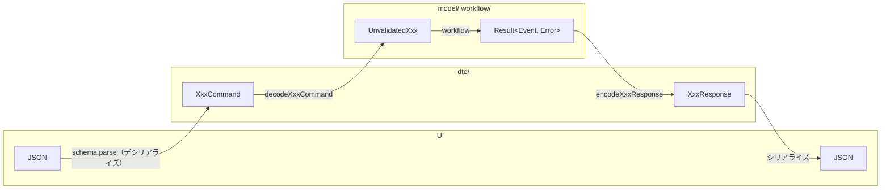

# アーキテクチャ

## 1. 全体像

### 1.1 このドキュメントの目的

### 1.2 依存の方向とデータの流れ

### 1.3 ディレクトリ構成（俯瞰）

## 2. 共通の型と道具 — `src/domain/building-blocks.ts`

### 2.1 Primitive（ブランド型）

### 2.2 Case / choice type

### 2.3 Result / AsyncResult とコンビネータ

### 2.4 pipe

## 3. 外部との接点 — `src/external/`

### 3.1 役割と置くもの・置かないもの

### 3.2 外部サービスごとのフォルダ分割

### 3.3 外部の失敗をドメインの失敗へ翻訳する

## 4. 境界の変換 — `src/domain/<bc>/dto/`

`dto/` は UI（ブラウザ）とドメインの間に立ち、ドメイン型と DTO 型を相互に変換する。
DTO 型と JSON の間の変換（シリアライズ）はフレームワークに任せ、この層では書かない。
下流（DB・認証プロバイダなど）とドメインの間の変換は `external/` の責務であり、ここでは扱わない。

### 4.1 どの境界を担当するか（`dto/` と `external/` の違い）

アプリには「外部」が2つある。上流の UI と、下流のインフラ（DB・認証プロバイダ）である。
`dto/` が担当するのは上流だけで、下流の翻訳は `external/` の各アダプタが行う。
どちらも「外の形をドメインの形に直す」仕事だが、置き場所を分けるのは依存の向きが違うからである。
`dto/` は `domain/` の内側にあり、`external/` を import してはならない。

### 4.2 DTO 型の定義（Command / Response / View と schema）

- **Command**: UI からの入力。zod の schema から `z.infer` で導出する。schema は「JSON がこの形をしているか」を確かめる構造の検査であり、「メールとして妥当か」のような業務ルールの検証はしない。それは `model/` の値オブジェクトの仕事である。
- **Response**: ワークフローの結果を UI に返す形。`{ ok: true; ... } | { ok: false; ... }` の直和で表し、失敗は文言まで含めて確定させる。
- **View**: 読み取り専用の表示用データ。ワークフローを経ずにドメインの状態を UI 向けに写したもの。

DTO 型はシリアライズ可能な値（string / number / boolean / null と、それらの配列・オブジェクト）だけで構成する。ブランド型や `Case` はここには出さない。

### 4.3 decode（DTO → ドメイン）

`decodeXxxCommand` は Command をドメインの未検証入力（`UnvalidatedXxx`）へ写す。
値の検証はしない。未検証入力を渡された先のワークフローが値オブジェクトを構築し、そこで初めて業務ルールが適用される。
URL パラメータのように、構造として正しくてもドメインの ID として解釈できない入力があるときだけ、decode は `Result` を返してよい。

### 4.4 encode（ドメイン → DTO）

`encodeXxxResponse` はワークフローの `Result<Event, Error>` を Response へ写す。
成功側はイベントから UI が必要とする値だけを取り出し、失敗側はエラーの種類ごとに文言と表示位置（どのフォーム項目か）を決める。
エラーの直和には `matchChoice` で網羅的に対応し、ドメインにエラーの種類が増えたとき翻訳漏れがコンパイルエラーになるようにする。

### 4.5 エラーをアプリの言葉に翻訳する

ドメインのエラーは「何が起きたか」の種類だけを持ち、利用者向けの言葉を持たない。言葉を与えるのは `dto/` の責務である。
失敗は3種類あり、いずれも `dto/` が Response 型の値として用意する。ページは `{ field: null, message }` のような Response の断片を自分で組み立てない。

1. **ドメインのエラー**: ワークフローが `Err` で返す。`encode` の中で翻訳する。
2. **境界の失敗**: ワークフローに渡す前の読み取りで起きる（ストアの行をドメイン型として解釈できない、など）。Wlaschin の RemoteServiceError にならい、これらは `model/` に型として定義し、`encode` が受けるエラー型の一員（`XxxError | StoreError`）として同じ場所で翻訳する。純粋なワークフロー自身のエラー型には混ぜない。ワークフローは読み取りをしないからである。サーバー関数は「読み取り → ワークフロー → 保存 → encode」を1本の `AsyncResult` のパイプラインとしてつなぐ。
3. **ワークフロー外の失敗**: 通信断や想定外の例外。サーバー側の `encode` を通れないため、`dto/` が Response 型の定数（`UNEXPECTED_XXX_RESPONSE`）として文言を確定させ、ページは `catch` でそれを表示するだけにする。

`dto/` に置く文言は、ドメインや境界の結果を利用者に伝える言葉までとする。
画面の見出し・ラベル・「読み込み中」のような画面固有の文言はページの責務であり、`dto/` には置かない。

### 4.6 ファイル分割の単位（1 ファイル = 利用者から見た 1 つの操作）

ファイルは利用者から見た操作の単位で切る。1 つの操作が状態によって複数のワークフローに分かれることがあり（トライアル中の解約と有料中の解約予約など）、その場合は同じ Response 型を共有してよい。
共有はファイル内に限る。複数のファイルで Response の形が偶然一致しても、共通型に昇格させない。DTO は操作の語彙で名付けられているべきで、汎用の封筒になると読み手が操作を追えなくなる。
「現在の状態を見る」のような読み取りは、それを利用する操作とは別のファイルにする。

### 4.7 ファイル内の並び順（型定義 → decode → encode）

読む人が全体像から詳細へ降りられるよう、次の順で並べる。

1. **型定義（デシリアライズ: JSON → DTO）**: schema と Command。UI から入ってくる形
2. **型定義（シリアライズ: DTO → JSON）**: FieldError、Response、View。UI へ返す形
3. **decode（DTO → ドメイン）**
4. **encode（ドメイン → DTO）**: 公開する encode 関数と、ワークフロー外の失敗を表す Response 定数。その下に encode だけが使う翻訳関数・文言定数を置く

private な補助関数や文言定数を別ブロックにまとめず、それを使う関数のすぐ下に置く。読み手が公開関数を読んだ直後に詳細へ降りられるようにするためである。
各ブロックはコメントの見出し（`// === 型定義（...） ===` など）で区切り、該当するものが無いブロックは省く。

### 4.8 命名規約（`*.dto.ts`）

- ファイル名: `<操作>.dto.ts`（`login.dto.ts`、`session.dto.ts`）
- 型: `XxxCommand` / `XxxResponse` / `XxxView` / `XxxFieldError`
- schema: `xxxCommandSchema`
- 関数: `decodeXxxCommand` / `encodeXxxResponse` / `encodeXxxView`
- ワークフロー外の失敗: `UNEXPECTED_XXX_RESPONSE`

## 5. ドメインモデル — `src/domain/<bc>/model/`

`model/` はドメインの語彙を型で表す。持つ振る舞いは値オブジェクトの構築子と、料金表のような定数だけで、状態を遷移させる関数は `workflow/` に置く。

ファイルは 3 種類の拡張子で分ける。分ける軸は「Id を持つかどうか」の 1 本であり、集約・エンティティ・値オブジェクトの 3 分類をフォルダやクラス階層で表すことはしない。関数型で書くとこの 3 つはどれも record と choice type であり、違いは同一性の扱いと一貫性の境界にしか現れないためである。

| 拡張子 | 置くもの | 例 |
|---|---|---|
| `*.primitive.ts` | 単一の値を包む値オブジェクト | `EmailAddress`、`PlanId` |
| `*.entity.ts` | Id を持ち、ライフサイクルを持つもの。集約ルート | `Subscription`、`Invoice` |
| `*.model.ts` | Id を持たない複合型。ワークフローの入力・イベント・エラー、複合値オブジェクト | `ValidatedLoginRequest`、`Registered`、`Session` |

### 5.1 値オブジェクト（`*.primitive.ts`）

`Primitive` の仕組みは §2.1 で述べた。ここでは配置と構築子の形だけを決める。

- 同じ概念に属する primitive を 1 ファイルにまとめる（`user.primitive.ts` に `UserId`、`EmailAddress`、`Password`）。ファイル名は概念名で、それを主に使う entity や model と揃える。
- 構築子は `Xxx.create` / `Xxx.value` のオブジェクト形式にする。検証を伴うなら `Result` を返し、失敗理由は `XxxError` として同じファイルに置く。文言は持たず、ユーザーに見せる言葉は境界層が決める。
- 信頼境界の内側から来る値（自前の認証基盤が発行した id など）は検証しないので `Result` を返さない。戻り値の型が「失敗しない」ことを語る。

### 5.2 エンティティと集約（`*.entity.ts`）

Id を持ち、時間とともに状態が変わるものを置く。状態は `Case` のユニオンで表し、各状態にはその状態で意味を持つフィールドだけを持たせる（`TrialSubscription` は `trialEndsAt` を持ち、`PaidSubscription` は持たない）。存在しえないフィールドの組み合わせを型で消すためである。

1 ファイルが 1 つの集約に対応する。集約の外からは Id だけで参照する（`Subscription` は `accountId` と `pendingInvoiceId` を持ち、`Account` や `Invoice` そのものは抱えない）。ルートでないエンティティが必要になったら、ルートと同じファイルに置く。集約の境界がファイルの境界に一致するようにするためである。

エンティティかどうかは「Id を持つか」だけで判定する。`Session` は `AnonymousSession` に Id が無いので値オブジェクトであり、`.model.ts` に置く。`Plan` は変更されない料金表だが `PlanId` で識別されるのでエンティティとして扱う。

### 5.3 ワークフローの語彙（`*.model.ts`）

ワークフローの入力・出力・失敗を、操作の単位で 1 ファイルにまとめる。Id を持たないので、すべて値オブジェクトである。イベントとエラーは操作の外では意味を持たないので、`*.event.ts` のように種類でファイルを分けず、操作ごとにまとめて見出しで区切る。

1. **入力**: 未検証入力（`UnvalidatedXxxRequest`。フィールドは string などの生の型）、検証済み入力（`ValidatedXxxRequest`）、ワークフローが読む現在の状態（`XxxContext`）、外部から与えられる判定材料
2. **イベント**: ワークフローの出力。到達する状態が複数あるなら `Case` のユニオンにする
3. **エラー**: `XxxError` のユニオンを先頭に置き、その構成要素を下に並べる。文言は持たない

各ブロックはコメントの見出し（`// === 入力 ===` など）で区切り、該当するものが無いブロックは省く。
操作名でないファイル（`session.model.ts`）は Id を持たない複合値オブジェクトを置く場所で、見出しは要らない。

### 5.4 命名規約

- ファイル名: `<概念>.primitive.ts` / `<概念>.entity.ts` / `<操作>.model.ts`（複合値オブジェクトは `<概念>.model.ts`）
- 値オブジェクト: `Xxx`、構築子 `Xxx.create` / `Xxx.value`、失敗理由 `XxxError`
- エンティティ: 概念名のユニオン `Subscription` と、状態を前置した各 Case `TrialSubscription`
- 入力: `UnvalidatedXxxRequest` → `ValidatedXxxRequest`、`XxxContext`
- イベント: 過去形（`Registered`、`TrialStarted`）
- エラー: `XxxError` と、状態を表す名詞の構成要素（`NotInTrial`、`EmailAlreadyTaken`）

## 6. ワークフロー — `src/domain/<bc>/workflow/`

### 6.1 ワークフローの形（入力 → 検証 → 遷移 → 出力）

### 6.2 I/O の依存の受け取り方

### 6.3 エラーの表現と集約

### 6.4 命名規約（`*.workflow.ts`）

## 7. 境界づけられたコンテキスト

### 7.1 コンテキストの切り方

### 7.2 コンテキスト間の関係

## 8. 画面 — `src/routes/`

### 8.1 ルートファイルとページフォルダの対応（`xxx.tsx` と `-xxx/`）

### 8.2 ページの責務（ワークフロー呼び出しと表示）

### 8.3 ページ内セクションの分割規約（folder-per-element）

### 8.4 サーバー側の入口（`api/`）

## 9. 汎用 UI — `src/components/`

### 9.1 domain に依存しないという制約

### 9.2 分類の基準

## 10. アプリの配線

### 10.1 ルーティングとコンテキストの組み立て

### 10.2 環境変数の扱い

## 11. 1つの機能を追加するときの手順

## 12. 用語集
