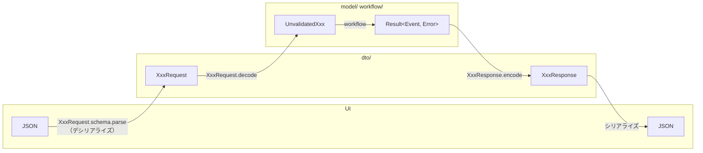

# アーキテクチャ

## 1. 全体像

### 1.1 このドキュメントの目的

### 1.2 依存の方向とデータの流れ

### 1.3 ディレクトリ構成（俯瞰）

### 1.4 ファイルの分け方と並べ方

層をまたいで共通する規約をここにまとめる。各層での具体的な順序は、その層の節に示す。

#### 分割の単位は「利用者から見た 1 つの操作」

`login`、`apply`、`cancel` のように、利用者が「1 つのことをした」と認識する単位で 1 ファイルにする。
行数を基準にしない。行数で切ると、境界が意味と関係のない場所に来るためである。1 ファイルに操作が 2 つ以上入ったら、そこが分割の合図になる。

#### 型定義と実装を別ファイルに分けない

同じ操作の型と実装は同じファイルに置く。型がそのまま仕様であり、実装はそれを満たしていることの証明である、という関係を目で追えるようにするためである。
別ファイルにすると、契約と実装が一致しているかを確かめるたびに 2 ファイルを行き来することになり、この費用は読むたびに発生する。
意味の区切りはファイルではなく、後述の見出しコメントで表す。

#### コンテキストの下は `model/` と `operation/` の 2 つに分ける

`domain/<bc>/` の直下には次の 2 つだけを置く。

| フォルダ | 置くもの | 分ける軸 |
|---|---|---|
| `model/` | このコンテキストが共有する集約と値オブジェクト（`*.entity.ts` / `*.primitive.ts` と、複合値オブジェクトの `*.model.ts`） | 概念 |
| `operation/<操作>/` | その操作でしか使わない語彙・境界の変換・ワークフロー（`<操作>.model.ts` / `<操作>.dto.ts` / `<操作>.workflow.ts`） | 利用者から見た操作 |

```
src/domain/subscription/
  model/
    subscription.entity.ts   subscription.primitive.ts
    plan.entity.ts           plan.primitive.ts
    ...
  operation/
    apply/
      apply.model.ts         apply.dto.ts
      apply-context.dto.ts   apply.workflow.ts
    schedule/
      schedule.model.ts      schedule.dto.ts
      end-trial.workflow.ts  end-period.workflow.ts
    subscription-view/
      subscription-view.dto.ts
```

この 2 つに分かれるのは、モデルの共有のされ方が 2 種類あるからである。集約と値オブジェクトは複数の操作が同じものを参照する（`subscription.entity.ts` はこのコンテキストの全ワークフローが参照する）。
1 つのモデルを複数の操作が共有することが境界づけられたコンテキストの定義そのものであり、これを操作ごとに分けるとモデルが分裂してコンテキストが割れる。
一方、その操作の入力・イベント・エラーと、境界の変換と、ワークフローは、どれもその操作の外では意味を持たない。だから操作のフォルダにまとめる。

`operation/` という中間フォルダを噛ませるのは、コンテキスト直下に「概念で名付けたフォルダ」と「操作で名付けたフォルダ」が並ぶのを避け、2 つの軸の違いをツリーの形で示すためである。
このフォルダを `workflow/` と名付けない。`*.workflow.ts` は §6 の特定の概念（依存を注入して組み立てるパイプライン関数）を指す語であり、同名のフォルダに dto が入ると語の意味が二重になる。
共有側を `context/` と名付けないのも同じ理由で、`XxxContext`（§5.3）および境界づけられたコンテキストと紛らわしいためである。

1 つの操作が状態によって複数のワークフローに分かれるとき（§4.6）は、操作フォルダの中で `*.workflow.ts` を分ける。フォルダが操作の境界を、ファイルがワークフローの境界を表す。

操作フォルダどうしは互いに import しない。操作をまたいで必要になったものは `model/` にあるべきものであり、そちらへ移す。
ファイル名から `<操作>.` の接頭辞は落とさない。`dto.ts` のような名前が並ぶと、エディタのタブやあいまい検索で見分けられなくなるためである。

`routes/` を画面の単位で縦にまとめる（§8.3）のに対し、ドメインだけがこの 2 軸を持つのは意図的である。画面はそのページでしか使わないものしか持たないが、ドメインは共有されることが本質だからである。

#### ファイルの中は全体像から詳細へ

上から読んだ人が、まず「このファイルは何をするか」を掴み、そのあと個々の部品に降りられるように並べる。

1. **型定義を実装より先に置く**。型が仕様であり、先に読めば全体が分かる
2. **全体を表す型を、構成部品の型より先に置く**（ワークフロー全体の型とその依存 → 各ステップの型）
3. **同じ種類のものが並ぶときは、データが流れる順に並べる**（JSON → DTO → ドメイン → DTO → JSON、検証 → 遷移 → イベント）
4. **実装は部品が先、それらを束ねる関数が最後**。全体像は型定義で示し終えているので、実装は組み上がる順に読める
5. **private な補助関数・文言定数は、それを使う公開関数のすぐ下に置く**。種類ごとに別ブロックへまとめない

各ブロックはコメントの見出し（`// === 型定義 ===` など）で区切り、該当するものが無いブロックは省く。

**`*.primitive.ts` だけは 1 を適用しない。** 値オブジェクトは型と構築子が 1 対 1 で短く、2 つのブロックに分けると 1 つの概念を読むのにファイル内を往復することになる。型・失敗理由の型・private な定数・`const` を 1 組として隣接させ、見出しのブロックは置かない（§5.1）。
型が多く「型を先に読めば全体が分かる」が効くのは `*.model.ts` / `*.entity.ts` / `*.workflow.ts` / `*.dto.ts` のほうで、そちらは 1 を守る。

## 2. 共通の型と道具 — `src/domain/building-blocks.ts`

### 2.1 Primitive（ブランド型）

### 2.2 Case / choice type

### 2.3 Result / AsyncResult とコンビネータ

### 2.4 pipe

## 3. 外部との接点 — `src/external/`

### 3.1 役割と置くもの・置かないもの

### 3.2 外部サービスごとのフォルダ分割

### 3.3 外部の失敗をドメインの失敗へ翻訳する

## 4. 境界の変換 — `src/domain/<bc>/operation/<操作>/*.dto.ts`

`dto/` は UI（ブラウザ）とドメインの間に立ち、ドメイン型と DTO 型を相互に変換する。
DTO 型と JSON の間の変換（シリアライズ）はフレームワークに任せ、この層では書かない。
下流（DB・認証プロバイダなど）とドメインの間の変換は `external/` の責務であり、ここでは扱わない。


```mermaid
flowchart LR
    subgraph ui[UI]
        JSONin[JSON]
        JSONout[JSON]
    end
    subgraph dto[dto/]
        Req[XxxRequest]
        Res[XxxResponse]
    end
    subgraph domain[model/ workflow/]
        Unv[UnvalidatedXxx]
        Result["Result&lt;Event, Error&gt;"]
    end
    JSONin -- "XxxRequest.schema.parse（デシリアライズ）" --> Req
    Req -- "XxxRequest.decode" --> Unv
    Unv -- "workflow" --> Result
    Result -- "XxxResponse.encode" --> Res
    Res -- "シリアライズ" --> JSONout
```

### 4.1 どの境界を担当するか（`dto/` と `external/` の違い）

アプリには「外部」が2つある。上流の UI と、下流のインフラ（DB・認証プロバイダ）である。
`dto/` が担当するのは上流だけで、下流の翻訳は `external/` の各アダプタが行う。
どちらも「外の形をドメインの形に直す」仕事だが、置き場所を分けるのは依存の向きが違うからである。
`dto/` は `domain/` の内側にあり、`external/` を import してはならない。

両方の境界で名前の付け方を揃える。**名詞がどちらの外部かを表し、動詞が向きを表す。**

> `decode` は常に「外の形 → ドメインの形」、`encode` は常に「ドメインの形 → 外の形」。

向きはドメインを中心に決まり、転送の向きではない。そのため上流と下流で名詞と動詞の組み合わせが反転する。

| | `decode`（ドメインへ） | `encode`（ドメインから） |
|---|---|---|
| 上流（UI） | `LoginRequest.decode` | `LoginResponse.encode` |
| 下流（ストア） | `StoredAccount.decode` | `StoredAccount.encode` |

**この反転そのものが「どちらの外部か」を語る**ので、`Request` / `Response` という語を両側で使っても曖昧にならない。
下流でも、ストアのように「読む・書く」相手には `StoredXxx` という名詞を使う。要求と返答をやり取りする相手（認証基盤・決済ゲートウェイ）には名詞を置かず、`VerifyCredentials` のような動詞名の関数型をポートとして定める（§3.2）。

### 4.2 DTO 型の定義（Request / Response / View と schema）

- **Request**: UI からの入力。zod の schema から `z.infer` で導出する。schema は「JSON がこの形をしているか」を確かめる構造の検査であり、「メールとして妥当か」のような業務ルールの検証はしない。それは `model/` の値オブジェクトの仕事である。
- **Response**: ワークフローの結果を UI に返す形。`{ ok: true; ... } | { ok: false; ... }` の直和で表し、失敗は文言まで含めて確定させる。
- **View**: 読み取り専用の表示用データ。ワークフローを経ずにドメインの状態を UI 向けに写したもの。

DTO 型はシリアライズ可能な値（string / number / boolean / null と、それらの配列・オブジェクト）だけで構成する。ブランド型や `Case` はここには出さない。

### 4.3 decode（DTO → ドメイン）

`XxxRequest.decode` は Request をドメインの未検証入力（`UnvalidatedXxxCommand`）へ写す。
値の検証はしない。未検証入力を渡された先のワークフローが値オブジェクトを構築し、そこで初めて業務ルールが適用される。
URL パラメータのように、構造として正しくてもドメインの ID として解釈できない入力があるときだけ、decode は `Result` を返してよい。

### 4.4 encode（ドメイン → DTO）

`XxxResponse.encode` はワークフローの `Result<Event, Error>` を Response へ写す。
成功側はイベントから UI が必要とする値だけを取り出し、失敗側はエラーの種類ごとに文言と表示位置（どのフォーム項目か）を決める。
エラーの直和には `matchChoice` で網羅的に対応し、ドメインにエラーの種類が増えたとき翻訳漏れがコンパイルエラーになるようにする。

### 4.5 エラーをアプリの言葉に翻訳する

ドメインのエラーは「何が起きたか」の種類だけを持ち、利用者向けの言葉を持たない。言葉を与えるのは `dto/` の責務である。
失敗は3種類あり、いずれも `dto/` が Response 型の値として用意する。ページは `{ field: null, message }` のような Response の断片を自分で組み立てない。

1. **ドメインのエラー**: ワークフローが `Err` で返す。`encode` の中で翻訳する。
2. **インフラストラクチャの失敗**: ストアや認証基盤や決済ゲートウェイに到達できない、保存できない、保存された行をドメイン型として解釈できない、など。Wlaschin の RemoteServiceError にならい、これらは `model/` に型として定義し、`encode` が受けるエラー型の一員（`XxxError | StoreError`）として同じ場所で翻訳する。
3. **ワークフロー外の失敗**: ブラウザとサーバーの間の通信断など、サーバー側の `encode` を通れないもの。`dto/` が Response オブジェクトの `unexpected` として文言を確定させ、ページは `catch` でそれを表示するだけにする。

**2 はすべて `Result` に乗せ、例外にしない。** 例外を投げてよいのはパニック（プログラムの誤りで、利用者が再試行しても直らないもの）だけである。インフラの失敗は再試行で直りうるので、型に現れていなければ扱いを選べない。外部アダプタは、外部を呼ぶ箇所だけを `try` で包んで境界エラーへ変換する。

境界エラーの型は、外部ごとに 1 つ置く。

| 型 | 置き場所 | 表すもの |
|---|---|---|
| `StoreError` | `subscription/model/store.model.ts` | ストアに到達できない、行を解釈できない |
| `AuthProviderError` | `auth/model/auth-provider.model.ts` | 認証基盤に到達できない |
| `PaymentGatewayError` | `subscription/operation/payment/payment.model.ts` | 決済ゲートウェイに到達できない |

いずれも調査用の `reason` を持つが、Response には出さない。

**ドメインのエラー語彙にインフラの失敗を混ぜない。** `LoginError` や `PayInvoiceError` は業務上の失敗だけを列挙し、広げるのはワークフローの戻り値の型のほうである（`AsyncResult<LoggedIn, LoginError | AuthProviderError>`）。読み取りはワークフローの外で起きるので `XxxError | StoreError` となり、途中に I/O を挟む操作では `XxxError | AuthProviderError` のように外部の失敗が加わる。どちらも `encode` が同じ場所で翻訳する。

**業務上の結果と、到達できない失敗を混同しない。** 決済が拒否されたのは業務上の結果（`PaymentOutcome` の `Failed`）で請求を失敗として確定させるが、ゲートウェイに到達できないのは `PaymentGatewayError` であり、請求を失敗にしてはいけない。型を分けることでこの取り違えを防ぐ。

サーバー関数は「読み取り → ワークフロー → 保存 → encode」を1本の `AsyncResult` のパイプラインとしてつなぐ。この合成は `application/` の責務である（§1.3）。

`dto/` に置く文言は、ドメインや境界の結果を利用者に伝える言葉までとする。
画面の見出し・ラベル・「読み込み中」のような画面固有の文言はページの責務であり、`dto/` には置かない。

### 4.6 ファイル分割の単位（1 ファイル = 利用者から見た 1 つの操作）

ファイルは利用者から見た操作の単位で切る。1 つの操作が状態によって複数のワークフローに分かれることがある（トライアル中の解約と有料中の解約予約など）。ワークフローが異なれば、同じファイルの中でも Response 型を分ける。形が一致するのは偶然であり、片方の失敗理由が増えたときに他方を巻き込むためである。
複数のファイルで Response の形が偶然一致しても、共通型に昇格させない。DTO は操作の語彙で名付けられているべきで、汎用の封筒になると読み手が操作を追えなくなる。
「現在の状態を見る」のような読み取りは、それを利用する操作とは別のファイルにする。

### 4.7 ファイル内の並び順（デシリアライズ → decode → encode → シリアライズ）

§1.4 の並び順を、この層ではデータが境界を通る順に当てはめる。冒頭の図の左から右がそのままファイルの上から下になる。

1. **型定義（デシリアライズ: JSON → DTO）**: schema と Request。UI から入ってくる形
2. **decode（DTO → ドメイン）**
3. **encode（ドメイン → DTO）**: 公開する Response / View オブジェクト。その下に encode だけが使う翻訳関数・文言定数を置く
4. **型定義（シリアライズ: DTO → JSON）**: FieldError、Response、View。UI へ返す形

schema の private const と Request 型は 1 に置き、同名の Request オブジェクトは 2 に置く。
Response / View オブジェクトは 3 に置き、`encode` と失敗時の定数をプロパティとして公開する。
Response の型が encode より下に来るが、型宣言は巻き上げられるので参照の問題は起きない。
読み手にとっては「何を受け取り、どう変換し、何を返すか」が処理順に並ぶ方が追いやすい。

### 4.8 命名規約（`*.dto.ts`）

- ファイル名: `<操作>.dto.ts`（`login.dto.ts`、`session.dto.ts`）
- 型: `XxxRequest` / `XxxResponse` / `XxxView` / `XxxFieldError`
- 変換: 型と同名の `const` に集約する。`XxxRequest.schema` / `XxxRequest.decode` / `XxxResponse.encode` / `XxxView.encode`
- ワークフロー外の失敗: `XxxResponse.unexpected`
- 認証が必要な操作への未認証アクセス: `XxxResponse.authenticationRequired`

## 5. ドメインモデル — `src/domain/<bc>/model/` と `operation/<操作>/*.model.ts`

ドメインの語彙を型で表す。持つ振る舞いは値オブジェクトの構築子と、料金表のような定数だけで、状態を遷移させる関数は `*.workflow.ts` に置く。
置き場所は §1.4 のとおり 2 つに分かれる。コンテキストが共有する集約と値オブジェクトは `model/` に、その操作でしか使わない語彙は `operation/<操作>/<操作>.model.ts` に置く。

ファイルは 3 種類の拡張子で分ける。分ける軸は「Id を持つかどうか」の 1 本であり、集約・エンティティ・値オブジェクトの 3 分類をフォルダやクラス階層で表すことはしない。関数型で書くとこの 3 つはどれも record と choice type であり、違いは同一性の扱いと一貫性の境界にしか現れないためである。

| 拡張子 | 置くもの | 例 |
|---|---|---|
| `*.primitive.ts` | 単一の値を包む値オブジェクト | `EmailAddress`、`MonthlyPrice` |
| `*.entity.ts` | Id を持ち、ライフサイクルを持つもの。集約ルート | `Subscription`、`Invoice` |
| `*.model.ts` | Id を持たない複合型。ワークフローの入力・イベント・エラー、複合値オブジェクト、choice type | `ValidatedLoginCommand`、`Registered`、`Session`、`PlanId` |

`PlanId` が `*.model.ts` にあるのは、**取りうる値が閉じた集合なので choice type（`Case<"Basic"> | Case<"Pro">`）で表している**ためである。「単一の値を包む」形ではないので primitive ではない。閉じた集合を文字列のブランド型にすると、どの値が存在するかの知識がドメインの外へ漏れる（§5.1）。

### 5.1 値オブジェクト（`*.primitive.ts`）

`Primitive` の仕組みは §2.1 で述べた。ここでは配置と構築子の形だけを決める。

- 同じ概念に属する primitive を 1 ファイルにまとめる（`user.primitive.ts` に `UserId`、`EmailAddress`、`Password`）。ファイル名は概念名で、それを主に使う entity や model と揃える。
- 構築子は `Xxx.create` / `Xxx.value` のオブジェクト形式にする。検証を伴うなら `Result` を返し、失敗理由は `XxxError` として同じファイルに置く。文言は持たず、ユーザーに見せる言葉は境界層が決める。
- 信頼境界の内側から来る値（自前の認証基盤が発行した id など）は検証しないので `Result` を返さない。戻り値の型が「失敗しない」ことを語る。
- **検証の有無は名前ではなく戻り値の型が語る。** 構築子は `create` 1 つだけで、`parse` のような第 2 の構築子を作らない。入力は常にプリミティブ（`string` / `Date` など）で受ける。
- **オブジェクトは名前空間であってレシーバではない。** `Xxx.value(v)` の形を守り `v.value()` にしない。`this` を使わない。可変状態を持たない。`create` / `value` 以外のプロパティを生やさない。
- **値から値を導く業務ルールは、オブジェクトのプロパティにせず独立した関数にする。** 「トライアルは 14 日」「期間は 1 ヶ月」のような規則は値の作り方ではないので、`trialPeriodEnd(trialUsedAt)` / `billingPeriodEnd(paidAt)` のように同じファイルの関数として置く。
- **取りうる値が閉じた集合なら、ブランド型ではなく choice type にして `*.model.ts` へ置く。** 文字列のブランド型にすると `value()` から表現が漏れ、永続化の文字列・画面の表示名・内部の判別子が同じものとして扱われてしまう。choice type なら、それぞれを `matchChoice` で選ぶ別の判断にできる。

ファイル内の並べ方は §1.4 の例外で、**1 つの値オブジェクトに関するものを隣接させる**。型 →（失敗理由の型）→（private な定数）→ `const` →（その値を作る関数）の順に置き、値オブジェクトどうしは空行で区切る。「型定義」「実装」の見出しブロックは置かない。

### 5.2 エンティティと集約（`*.entity.ts`）

Id を持ち、時間とともに状態が変わるものを置く。状態は `Case` のユニオンで表し、各状態にはその状態で意味を持つフィールドだけを持たせる（`TrialSubscription` は `trialEndsAt` を持ち、`PaidSubscription` は持たない）。存在しえないフィールドの組み合わせを型で消すためである。

1 ファイルが 1 つの集約に対応する。集約の外からは Id だけで参照する（`Subscription` は `accountId` と `pendingInvoiceId` を持ち、`Account` や `Invoice` そのものは抱えない）。ルートでないエンティティが必要になったら、ルートと同じファイルに置く。集約の境界がファイルの境界に一致するようにするためである。

エンティティかどうかは「Id を持つか」だけで判定する。`Session` は `AnonymousSession` に Id が無いので値オブジェクトであり、`.model.ts` に置く。`Plan` は変更されない料金表だが `PlanId` で識別されるのでエンティティとして扱う。

### 5.3 ワークフローの語彙（`*.model.ts`）

ワークフローの入力・出力・失敗を、操作の単位で 1 ファイルにまとめる。Id を持たないので、すべて値オブジェクトである。イベントとエラーは操作の外では意味を持たないので、`*.event.ts` のように種類でファイルを分けず、操作ごとにまとめて見出しで区切る。

1. **入力**: 未検証入力（`UnvalidatedXxxCommand`。フィールドは string などの生の型）、検証済み入力（`ValidatedXxxCommand`）、ワークフローが読む現在の状態（`XxxContext`）、外部から与えられる判定材料
2. **イベント**: ワークフローの出力。到達する状態が複数あるなら `Case` のユニオンにする
3. **エラー**: `XxxError` のユニオンを先頭に置き、その構成要素を下に並べる。文言は持たない

各ブロックはコメントの見出し（`// === 入力 ===` など）で区切り、該当するものが無いブロックは省く。
操作名でないファイル（`session.model.ts`）は Id を持たない複合値オブジェクトを置く場所で、見出しは要らない。

### 5.4 命名規約

- ファイル名: `<概念>.primitive.ts` / `<概念>.entity.ts` / `<操作>.model.ts`（複合値オブジェクトは `<概念>.model.ts`）
- 値オブジェクト: `Xxx`、構築子 `Xxx.create` / `Xxx.value`、失敗理由 `XxxError`
- エンティティ: 概念名のユニオン `Subscription` と、状態を前置した各 Case `TrialSubscription`
- 入力: `UnvalidatedXxxCommand` → `ValidatedXxxCommand`、`XxxContext`
- イベント: 過去形（`Registered`、`TrialStarted`）
- エラー: `XxxError` と、状態を表す名詞の構成要素（`NotInTrial`、`EmailAlreadyTaken`）

## 6. ワークフロー — `src/domain/<bc>/operation/<操作>/*.workflow.ts`

### 6.1 ワークフローの形（入力 → 検証 → 遷移 → 出力）

### 6.2 I/O の依存の受け取り方

### 6.3 エラーの表現と集約

### 6.4 命名規約（`*.workflow.ts`）

## 7. 境界づけられたコンテキスト

### 7.1 コンテキストの切り方

### 7.2 コンテキスト間の関係

## 8. 画面 — `src/routes/`

### 8.1 ルートファイルとページフォルダの対応（`xxx.tsx` と `-xxx/`）

### 8.2 ページの責務（ワークフロー呼び出しと表示）

### 8.3 ページ内セクションの分割規約（folder-per-element）

### 8.4 サーバー側の入口（`api/`）

## 9. 汎用 UI — `src/components/`

### 9.1 domain に依存しないという制約

> メモ（本文未執筆）: `components/` はアプリのドメインを知らない部品だけを置く。
> 画面固有の導線や語彙を持つ部品は、全ページ共通であっても `routes/` にコロケーションする。
> 例: Header は「申し込み」「契約」という固有の導線とログイン状態を知るため、
> `components/layout/` から `routes/-root/header.tsx` へ移した（2026-09-19）。

### 9.2 分類の基準

## 10. アプリの配線

### 10.1 ルーティングとコンテキストの組み立て

### 10.2 環境変数の扱い

## 11. 1つの機能を追加するときの手順

## 12. 用語集
